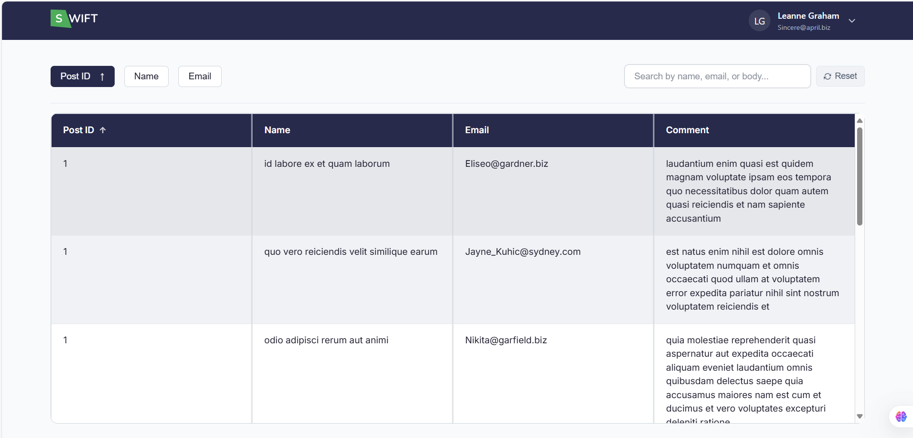
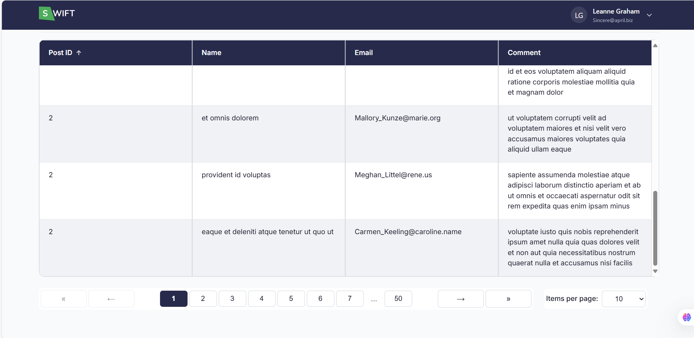
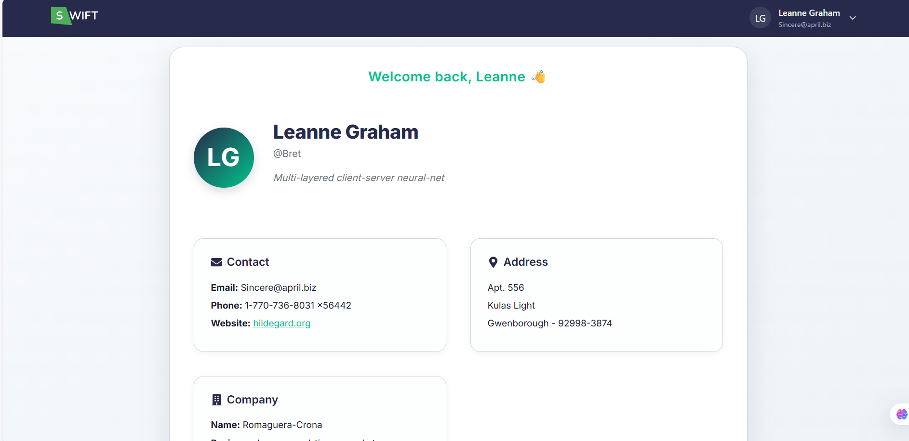
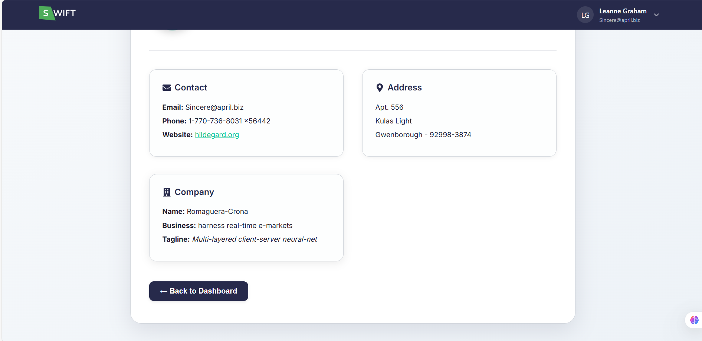

 # Swift Dashboard

A modern, responsive dashboard application built with React that allows users to view, sort, filter, and manage comments data fetched from an external API. The application features a clean, user-friendly interface with a focus on performance and usability.

<div align="center">
  
  
  
  
</div>

## Features

- **Data Visualization**: Displays comments in a sortable and searchable table format
- **Responsive Design**: Fully responsive layout that works on all device sizes
- **Sorting**: Sort data by Post ID, Name, or Email in ascending or descending order
- **Search**: Real-time search functionality to filter comments by name, email, or content
- **Pagination**: Easy navigation through large datasets with customizable items per page
- **Persistent State**: User preferences and data are saved in local storage
- **Reset Functionality**: One-click reset to clear all filters and return to default view
- **User Profile**: View detailed user information in a dedicated profile section

## Technologies Used

- **Frontend**: React 19
- **Routing**: React Router v7
- **UI Components**: Custom CSS with CSS Variables for theming
- **Icons**: React Icons
- **API**: JSONPlaceholder (for demo data)
- **State Management**: React Hooks (useState, useEffect, useMemo)
- **Build Tool**: Create React App

## Getting Started

### Prerequisites

- Node.js (v14 or later)
- npm or yarn

### Installation

1. Clone the repository:
   ```bash
   git clone https://github.com/your-username/swift-dashboard.git
   cd swift-dashboard
   ```

2. Install dependencies:
   ```bash
   npm install
   # or
   yarn install
   ```

3. Start the development server:
   ```bash
   npm start
   # or
   yarn start
   ```

4. Open [http://localhost:3000](http://localhost:3000) to view it in your browser.

## Usage

1. **Viewing Comments**:
   - The dashboard loads with sample comments data
   - Scroll through the table to view all comments

2. **Sorting Data**:
   - Click on column headers to sort by that field
   - Click again to toggle between ascending and descending order

3. **Searching**:
   - Use the search bar to filter comments by name, email, or content
   - The table updates in real-time as you type

4. **Pagination**:
   - Use the pagination controls at the bottom to navigate through pages
   - Adjust the number of items shown per page using the dropdown

5. **Resetting**:
   - Click the "Reset" button to clear all filters and return to the default view

## Project Structure

```
src/
├── components/         # Reusable UI components
│   ├── CommentTable/  # Table component for displaying comments
│   ├── Navbar/        # Navigation bar component
│   ├── Pagination/    # Pagination controls
│   ├── SearchBar/     # Search input component
│   └── SortContainer/ # Sorting controls
├── pages/             # Page components
│   ├── Dashboard/     # Main dashboard page
│   └── Profile/       # User profile page
├── styles/            # Global styles and theming
└── utils/             # Utility functions
```

## Contributing

Contributions are welcome! Please feel free to submit a Pull Request.

## License

This project is licensed under the MIT License - see the [LICENSE](LICENSE) file for details.

## Acknowledgments

- [JSONPlaceholder](https://jsonplaceholder.typicode.com/) for the free fake API
- React community for the awesome ecosystem